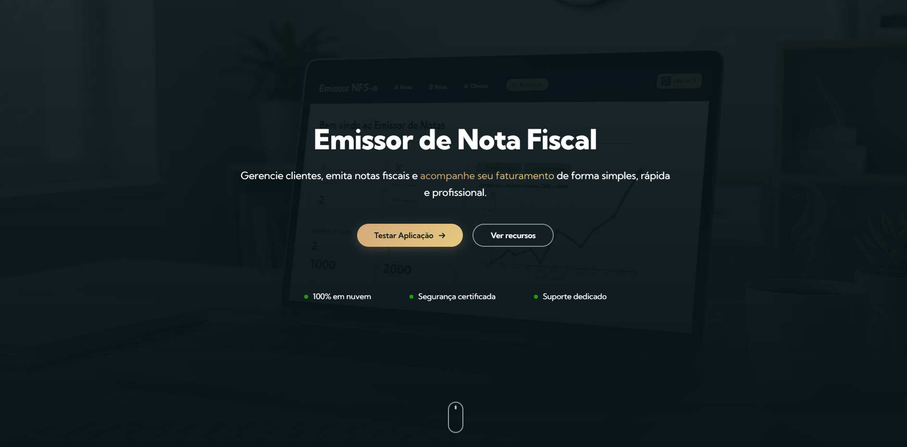

# Emissor de Nota Fiscal - Landing Page

Landing page desenvolvida para apresentar o sistema **Emissor de Nota Fiscal**, um web aplicativo criado para simplificar a emissão e o controle de notas fiscais.

A página apresenta os principais benefícios do sistema, estatísticas, funcionalidades e um acesso direto para testar a aplicação.

---

## 🚀 Acesse o projeto

🌐 Landing Page  
https://SEU-LINK-VERCEL.vercel.app

💻 Aplicação Web  
https://emissor-nota-fiscal-kh8r.vercel.app/

---

## 📸 Preview

---

## ✨ Funcionalidades da Landing Page

- Apresentação do sistema
- Seção de benefícios
- Cards de funcionalidades
- Estatísticas animadas
- Call To Action (CTA)
- Footer com informações do produto
- Design moderno focado em SaaS

---

## 🛠 Tecnologias utilizadas

- React
- CSS Modules
- React Icons
- React CountUp (animação de números)

---

## 📂 Estrutura do projeto

emissor-nota-fiscal
│
├ backend
├ frontend
└ landing

A landing page está localizada na pasta:

landing/

---

## 🎯 Objetivo do projeto

Este projeto foi desenvolvido com o objetivo de:

- Demonstrar habilidades em **React**
- Criar uma **landing page moderna**
- Integrar uma página de apresentação com um **web aplicativo funcional**
- Aplicar boas práticas de **UI/UX**

---

## 📦 Deploy

A landing page foi publicada utilizando:

- Vercel

---

## 👨‍💻 Autor

Desenvolvido por **[Seu Nome]**

LinkedIn: https://linkedin.com  
GitHub: https://github.com